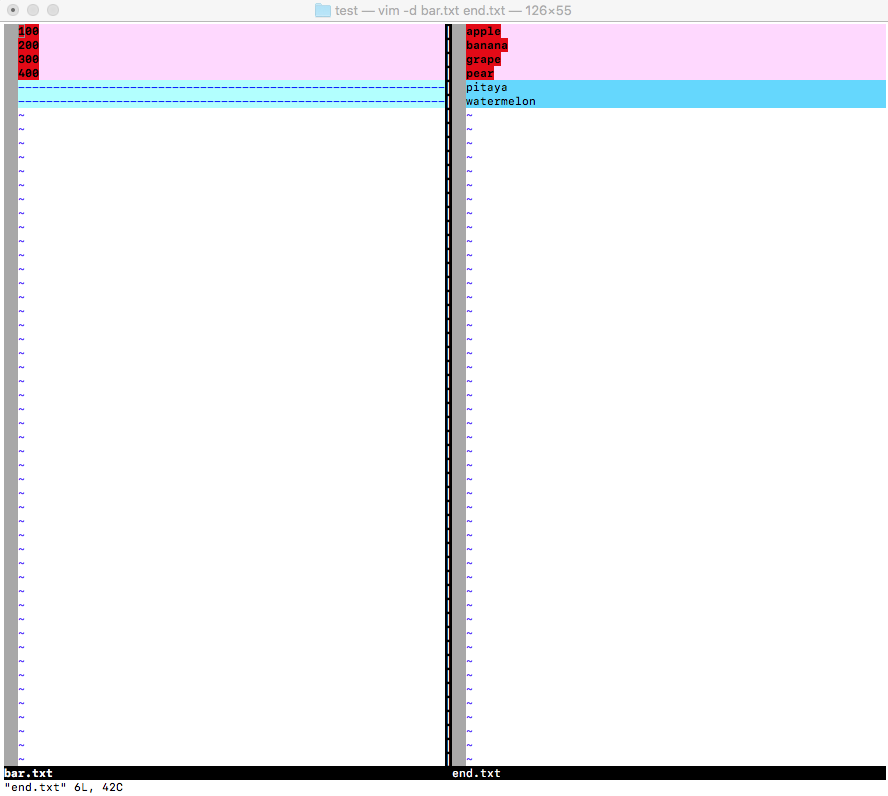
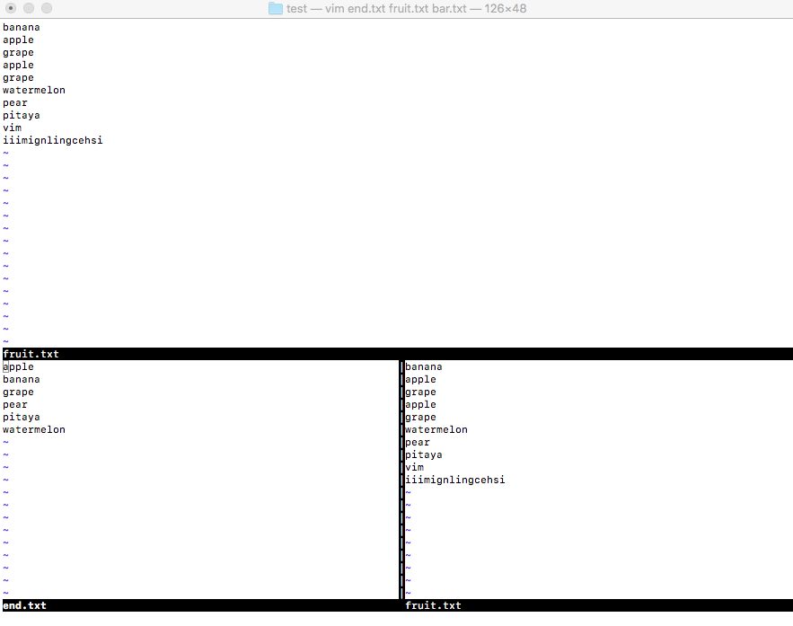
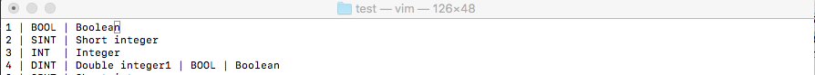
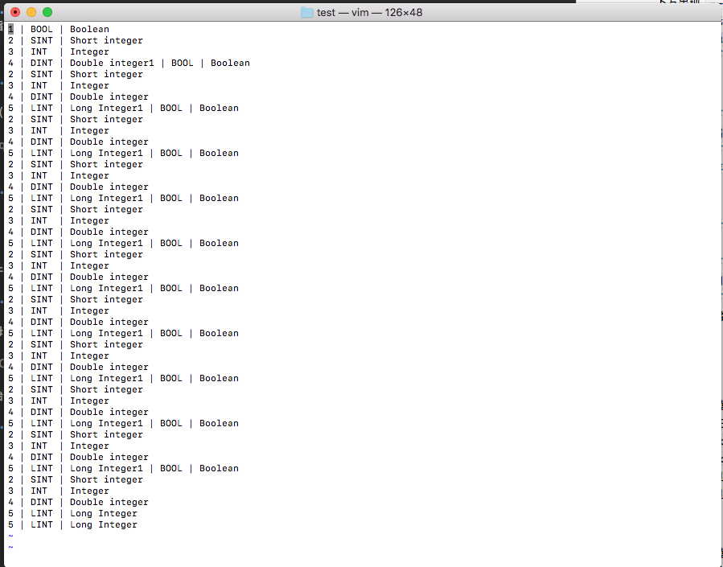

##编辑器 -vim

1. 启动vim。可以通过**vi**或者**vim**命令来启动vim，启动时可以指定文件名来打开一个文件，如果没有指定文件名，也可以在保存的时候指定文件名。
 
		AdministratordeiMac:test administrator$ vim fruit.txt
	
2. 命令模式、编辑模式和末行模式：
	* 启动vim进入的是命令模式（也称为Normal模式），在命令模式下输入英文字母`i`会进入编辑模式（insert模式），在屏幕下方出现 `-- INSERT --`提示；
	* 在编辑模式先`Esc`会回到命令模式，此时如果输入英文：会进入**末行模式**，在**末行模式**下输入`q!`可以在**不保存**当前工作的情况下强行退出vim
	* 在命令模式下输入`v`会进入可视模式（Visual模式），可以只用光标选择一个区域再完成对应的操作

3. 保存和退出vim：
	* 在命令模式下`:`进入**末行模式**，输入`wq`可以实现保存退出；
	* 如果想**放弃**编辑的内容输入`q!`强行退出
	* 在命令模式下也可以输入`ZZ`实现保存退出
	* 如果只想保存文件不退出，那么可以在**末行模式**下输入`w`,可以再`w`后面输入空格再指定保存的文件名

4. 光标操作
	* 在命令模式下可以通过`h` 、`j` 、`k` 、`l`来控制光标向光标左、下、上、右的方向移动，可以在字母前输入**数字来表示移动距离**，例如`10h`表示向左移动10个字符。
	* 在命令模式下可以通过`Ctrl+y` 和`Ctrl+e`来实现向上、向下滚动一行文本的操作，可以通过`Ctrl+f`和`Ctrl+b`来实现向前和向后翻页的操作。
	* 在命令模式下可以通过输入英文字母`G`将光标移动到文件的末尾，可以通过`gg`将光标移动到文件的开始，在可以通过在`G`前输入数字来将光标移动到指定的行。

5. 文本操作
	* **删除**：
		* 在命令模式下用`dd`来删除整行；
		* 也可以在`dd`前加数字来指定删除的行数；
		* 可以用`d$`来实现删除从光标处删到行尾的操作
		* 可以用`d0`来实现从光标处删除行首的操作
		* 如果想删除一个单词，可以使用`dw`
		* 如果要删除全文，可以输入`:%d`（其中`:`用来从命令模式进入末行模式）
		
	* **复制和粘贴**
		* 在命令模式下可以用`yy`来复制整行
		* 在`yy`**前加数字**来制定复制行数
		* 通过`p`将复制的内容粘贴到光标所在的地方
	* **撤销和恢复**
		* 在 命令模式下输入`u`可以撤销之前的操作
		* 通过`Ctrl+r`可以恢复被撤销的操作
	* **对内容进行排序**
		* 在命令模式下输入`%!sort`

6. 查找和替换
	* 查找操作需要输入`/`进入末行模式提供正则表达式来匹配与之对应的内容，例如：`/doc.*\.`,输入`n`来向前搜索，也可以输入`N`来向后搜索
	* 替换操作需要输入`:`进入末行模式，并指定搜索范围、正则表达式以及替换后的内容和匹配选项，例如：
	`:1,$s/doc.*/hello/gice`,其中：
		* `g` -global：全局匹配
		* `i` -ignore case：忽略大小写匹配
		* `c` -confirm：替换时需要确认
		* `e` -error：忽略错误
7. 参数设定：在输入`:`进入末行模式后可以对vim进行设定
	* 设置Tab键的空格数：`set ts=4`
	* 设置显示/不显示行号：`set nu `/ `set nonu`
	* 设置启用/关闭高亮语法：`syntax on` / `syntax off`
	* 设置显示标尺（光标所在行和列）：`set ruler`
	* 设置启用/关闭搜索结果高亮：`set hls` / `set nohls`

	> 说明：如果希望上面的这些设定在每次启动vim是都能生效，需要将这些设定写到**用户主目录下的`.vimrc`**文件中。
	
8. 高级技巧
	* 比较多个文件

			AdministratordeiMac:test administrator$ vim -d bar.txt end.txt
			2 files to edit
			

	* 打开多个文件
	
			AdministratordeiMac:test administrator$ vim fruit.txt bar.txt end.txt 

	*	文件间切换
		* Ctrl+6 ---两文件间的切换
		* `:bn`  --- 下一个文件
		* `:bp`  --- 上一个文件
		* `:ls`  --- 列出打开的文件，带编号
		* `:b1~n` ---切换至第n个文件
	 
	 			
	 
	* 拆分和切换窗口 
		* `:sp` ----水平切分窗口
		*	`:vsplit` -----垂直切分窗口
	 
	  >可以在末行模式中输入sp或vs来实现对窗口的水平或垂直拆分，这样我们就可以同时打开多个编辑窗口，通过按两次Ctrl+w就可以实现编辑窗口的切换，在一个窗口中执行退出操作只会关闭对应的窗口，其他的窗口继续保留。
	  
	  
	  
	* 映射快捷键（在vim下可以将一些常用的操作映射为快捷键来提升工作效率）
		* 示例：在命令模式下输入`F4`执行从第一行开始删除1000行代码的操作
		 
			`:map <F4> gg1000dd `
		* 示例2：在编辑模式下输入`__main`直接补全`if __name__ == '__main__':`

			`:ignoremap __main if __name__ == '__main__':`
		>说明：上面示例中2`ignoremap`中的`i`表示映射的键在编辑模式使用，`nore`表示不要递归，这一点非常重要，否则如果键对应的内容中本身又出现本身，就会引发递归（相当于进入了死循环）。如果希望映射的快捷键每次启动vim时候都能生效，需要将映射写到**用户主目录下`.vimrc`**文件中。
		
			>>*  vim 有个cd命令。用来更改当前文件夹。
			
			>>	* `:cd sth` 进入sth文件夹。这样新文件保存之后就在当前文件夹
			不过如果你打开一个已经保存的文件后然后更改当前文件夹是不会改变保存路径的。你必须
			为`:write` 指定参数。
			
			
			>> * 保存的时候可以指定路径：
			
			>>	 * `:write sth/file.cpp`这样把文件保存到相对路径sth/下。你也可以使用绝对路径。
			vim不会自动建立不存在的文件夹。你要手动建立。
	* 录制宏
		* 在命令模式下输入`qa`开始录制宏（其中`a`是寄存器的名字，也可以是其他英文字母数字或者0~9的数字） 
		* 执行你的操作（光标操作，编辑保存等），这些操作都会被录制下来
		* 如果录制操作已经完成，按`q`结束录制
		* 通过`@a`（`a`是刚才使用的寄存器的名字）播放宏，如果需要多次执行可以在前面加上数字，例如`100@`将表示将宏播放100次。
		* 可以试一试下面的示例来体验录制宏的操作，该示例来来源于[Harttle Land](https://harttle.land/tags.html#Vim)网站，该网站提供很多vim使用技巧，可以玩一下。
		
	    
	    1. 首先按几次`Esc`进入Normal（命令）模式，开始录入a寄存器输入`qa`
	    2. 光标移动到首行`^`,进入插入模式`i`，插入分隔符`‘`，进入命令模式，再插入数据
	    3. 在Normal模式下结束录制按`q`
	    4. 在Normal模式下输入`100@a`会执行100次a寄存器中的宏。如下
	    	  
	  
	  
	  
	